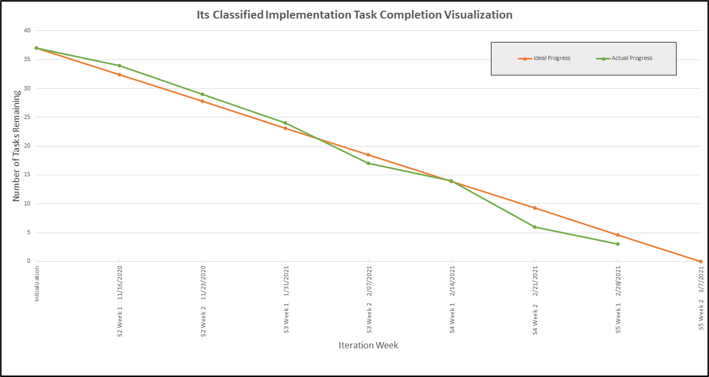
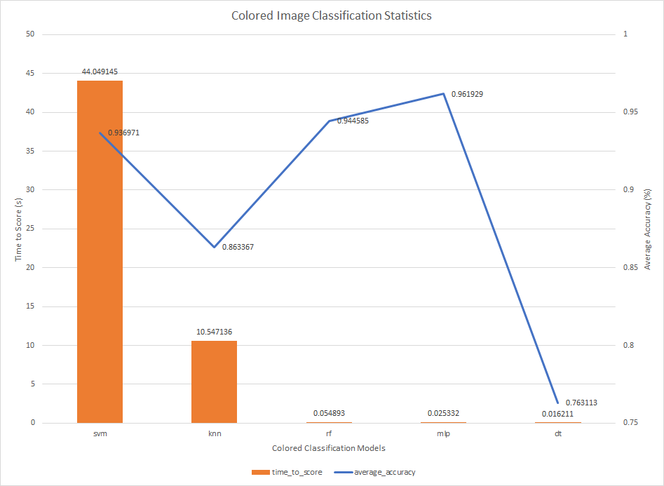
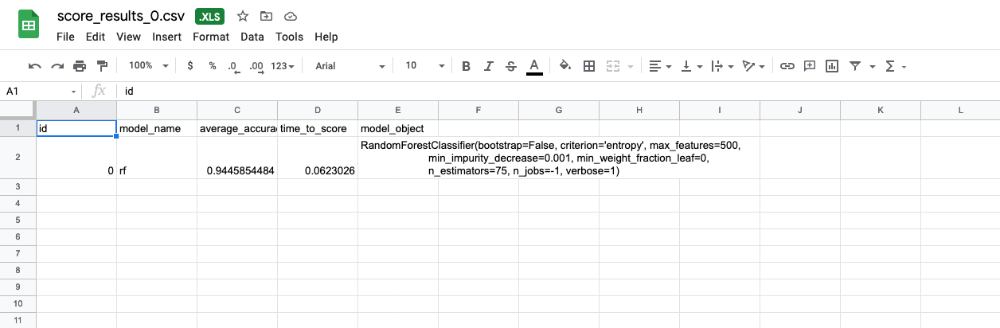
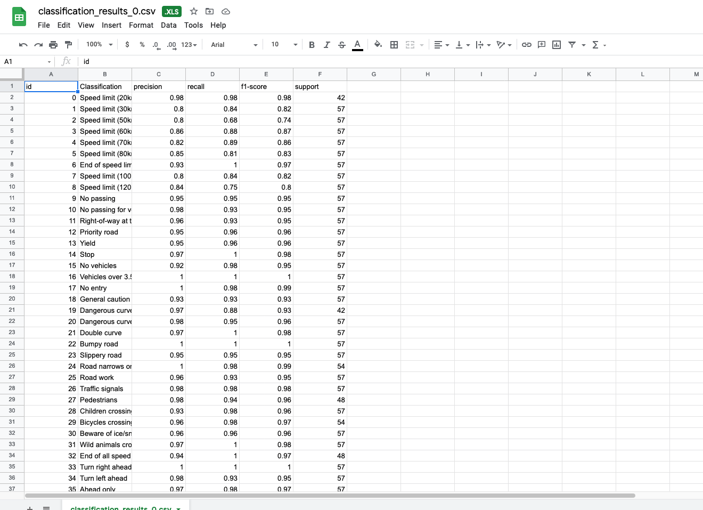
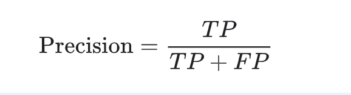
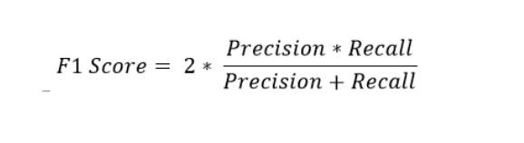
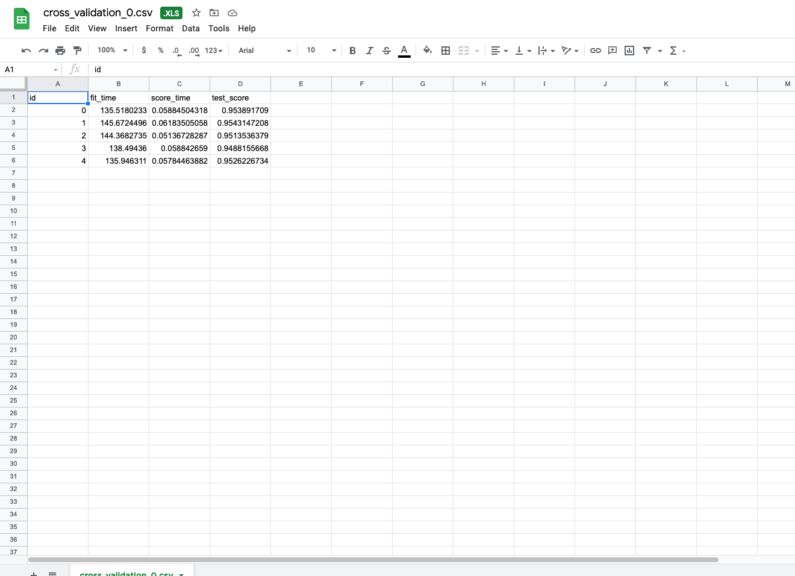
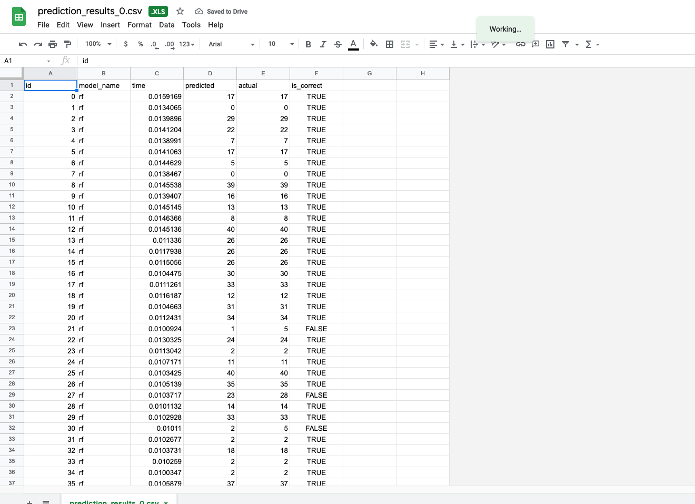

Return [Home](index.md)

# Blog 10: Final Implementation Phase

This the first week of Sprint 5 Iteration. Since this is the first part of the final implementation phase, the objective 
of this first week involved restructuring AI models, completing final tests for algorithm functionality, unit testing, 
and finishing up the UI implementation. 

We are 65% complete with sprint 5 and overall implementation is about 90% complete, the UI is about 50% complete. The 
burn down chart illustrates that we are currently ahead of schedule from our ideal projections, this is tremendous news 
for our team because it provides us with more time to work on and improve other aspects of our project. 

## Statistics For Colored Image Accuracy
The chart demonstrates the performance of each machine learning algorithms, and the time it took it to reach that accuracy.
Based off the chart you can visualize how some classification algorithms take less time to make a prediction and have better 
performance than others.

## AI MODELS GENERATED REPORTS

The animated gif above illustrates the automatic report that is being generated after running the models. The csv report 
is stored into a google cloud drive and saves additional information about the models. The csv report generates three 
categories of information that pertain to each model. 

First in the colored folder contains some information about the model's efficiency and performance. When you click 
on the file, you have the option to view the score result, classification result, cross validation result, and prediction 
result. The score result contains model name, average accuracy, the time it took the model to calculate the score, and 
the objective of the model. 

Currently, only one model report is being generated. The reason for this is that generating the model report is 
extremely intensive and requires a lot of time. The models were left running overnight, and they are still yet to finish. 
At the moment, we estimate that it would take somewhere around 20 hours for all the models finish. Moreover, it seems like 
the amount of time may vary depending on the machine that it is being run on. More information to come on this matter 
later on, once the reports have been generated for the all the models. 

#
The classification csv file contains the different types of traffic road signs that are 
being identified, and the different score types. Each score types is identified through true positives, false positives, 
and false negatives. For instance, the precision score is calculate by the equation. This equation calculates the 
positive prediction value. 

## 

## 
The recall score calculates the sensitivity which is the measurement of proportion of positives that are correctly 
identified.

## 

## 
The f1 score measures the combined score of precision and recall, which is essentially the measure of the average of 
two. 

##

The cross validation result stores additional information such as fit time, score time, and test accuracy of each different
model. The prediction result provides a more comprehensive analysis by running tests on a larger data sample. The model is 
run on over 2000 images and then generates the model name, time it took to classify each image, the predicted and actual 
results and whether it was a correct prediction.

##
Updated by Daniel Antonelli & Rigoberto Gonzalez on 2/27/2021
