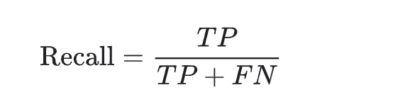

Return [Home](index.md)

# Blog 10: Final Implementation Phase

This was the first week of Sprint 5. Since this is the first part of the final implementation phase, the objective 
of this first week involved restructuring AI models, completing final tests for algorithm functionality, unit testing, 
and finishing up the UI implementation. 

We are 65% complete with sprint 5 and overall implementation is about 90% complete. More than half of the overall UI 
has been completed thus far. However, for this first week of sprint 5 iteration the UI is about 50% complete. As far as 
implementations go, we are most of the way done and this final sprint was mostly concerned with refactoring and improving
the existing models. The burn down chart illustrates that we are currently ahead of schedule from our ideal projections, 
this is tremendous news for our team because it provides us with more time to work on and improve other aspects of our 
project. 

## STATISTICS FOR COLORED IMAGE ACCURACY
The chart demonstrates the performance of each machine learning algorithms, and the time it took it to reach that accuracy.
Based off the chart you can visualize how some classification algorithms take less time to make a prediction and have better 
performance than others. 

## AI MODELS GENERATED REPORTS

The animated gif above illustrates the automatic report that is being generated after running the models. The csv report 
is stored into a Google cloud drive and saves additional information about the models. The csv report generates three 
categories of information that pertain to each model. 

### SCORE REPORT 

First in the colored folder contains some information about the model's efficiency and performance. When you click 
on the file, you have the option to view the score result, classification result, cross validation result, and prediction 
result. The score result contains model name, average accuracy, the time it took the model to calculate the score, and 
the objective of the model. 

Currently, only one model report is being generated. The reason for this is that generating the model report is 
extremely intensive and requires a lot of time. The models were left running overnight, and they are still yet to finish. 
At the moment, we estimate that it would take somewhere around 20 hours for all the models finish. Moreover, it seems like 
the amount of time may vary depending on the machine that it is being run on. More information to come on this matter 
later on, once the reports have been generated for the all the models. It is important to note that the results functionality
works with all implemented models, but due to execution limitations, a conclusive report has not yet been generated.

### CLASSIFICATION REPORT
The classification csv file contains the different types of traffic road signs that are being identified, and the 
different score types. Each score types is identified through true positives, false positives, 
and false negatives. For instance, the precision score is calculate by the equation. This equation calculates the 
positive prediction value. 

In order to get a more comprehensive analysis, we need to fully evaluate the effectiveness of each model, and to do this, 
we need to examine other types of evaluation metrics. Often times, when you are evaluating machine learning algorithms 
you typically use the metric measure of the accuracy score. When using the accuracy score to evaluate the algorithms, 
you may get high accuracy of 90% or above and it may seem like the model is performing well. However, when the accuracy 
score is evaluated against other metrics, it produces poor results. This is the reason why other score types are necessary 
because the classification accuracy alone does not tell the full store and is not enough to truly judge the performance 
of the model.

As mentioned above, each score types is identified through true positives, false positives, and false negatives. A true 
positive is the case in which we predicted YES, and the actual output was also YES. A false positive is the case in which 
we predicted YES, and the actual output was NO. A false negative is the case in which we predicted NO, and the actual 
output was YES. 

#### PRECISION
Now that we have a better understanding of the importance of these different types of score, let us analyze these equations.
The precision score as the equations illustrates is the true positive divided by the true positive plus the false positive. 
The precision score is concerned with answering the following question, what proportion of positive identification 
was actually correct. For example, if our true positive is 1, and our false positive is 1, then our model has a precision 
score of 0.5 because 1/1+1 = 0.5. In other words, this means that when the model predicts a stop sign, it is correct 50% 
of the time. 

#### RECALL
The recall score attempts to answer the following question, what proportion of the actual positive was identified correctly.
In a mathematical term, recall is defined as the true positive divided by the true positive plus the false negative. For
example, if our true positive was 1, and our false negative was 6, then our model has a recall score of 0.16 or 16% because
1/1+5 = 0.16. This means that the model correctly identifies 16% of stop signs. 

#### F1 SCORE
The f1 score measures the combined score of precision and recall, and is essentially the measure of the average of 
two. F1 score is needed when you want to seek a balance between prevision and recall. When you need a balance between
the precision and recall and there exist an uneven class distribution, f1 score might be a better metric to use. 

### CROSS VALIDATION REPORT
The cross validation result stores additional information such as fit time, score time, and test accuracy of each different
model. The prediction result provides a more comprehensive analysis by running tests on a larger data sample. The model is 
run on over 2000 images and then generates the model name, time it took to classify each image, the predicted and actual 
results and whether it was a correct prediction. The cross validation takes a subset of the dataset for training and testing
and scores the model. 

### PREDICTION REPORT
When building and evaluating any machine learning models, there is a crucial step that involves validating the stability 
of the model. You cannot simply just fit your model to your training dataset and hope it would accurately work on new 
real world data it has never seen before. Because of this, you need some kind of assurance that your model has done a 
decent job of learning and recognizing most of the important patterns correctly and that it has low bias level. Therefore, 
the purpose of cross validation is to provide an accurate prediction and representation of how the model would perform 
on unseen data.

Updated by Daniel Antonelli & Rigoberto Gonzalez on 2/28/2021
