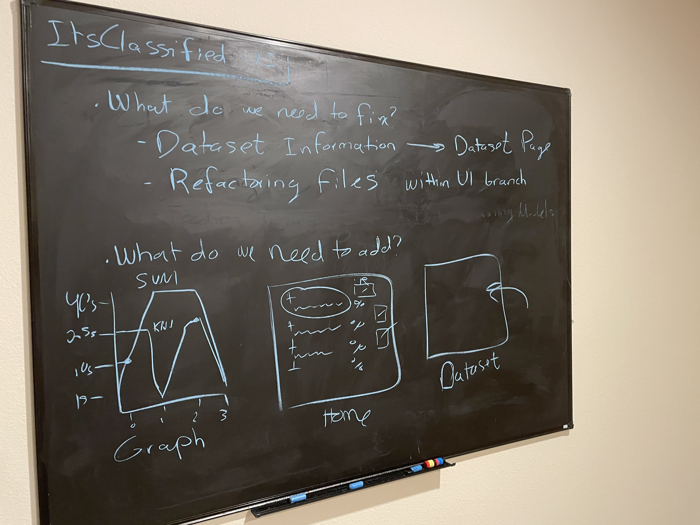

# Blog 11: Final Implementation Phase
This was the second week of Sprint 5. Since this is the last part of the final implementation phase, the objective of
this last week is the same as the first week. Which involved restructuring AI models, generating the models reports,
completing final tests for algorithm functionality, unit testing, and finishing up the UI implementation.

## Deliverable 10 Major Components
This deliverable consisted of compiling a report summary of the prototyping effort for each major component, as well as
the overall integrated system. In this deliverable, we reflect back on the overall project and document how each major
component was built, and provide a high-level description of the various tools that were utilized to make this project
possible. Our project prototype comprised 5 classifier algorithms and interactive UI. The algorithms consisted of
Support Vector Machine (SVM), Random Forest, Decision Tree, K-Nearest Neighbors (KNN), and Convolution
Neural Network (CNN).

## Preprocessing Tools
preprocessing and formatting the dataset. This the step helps to ensure that the datasets are correctly formatted and 
fitted before being processed to train the model. To perform this step, python, NumPy, Pandas, OpenCV, and Scikit-learn 
libraries were utilized. In this stage, the python language was mostly used to read in the dataset and to perform 
serialization and deserialization. NumPy and Pandas were used to convert the image dataset into an array format and to 
read in a CSV file. The Sklearn library was used to split the training dataset. Also, Matplotlib and Seaborn were 
utilized to perform visualization on the dataset and the models. These tools provide a high-level interface for drawing 
attractive and informative statistical graphics. The visualization libraries were used to plot the histogram of the 
datasets, the accuracy of the model after training it, and to display sample images.

## Model Building Tools
The main library that was used to implement the models was Scikit-learn, Keras, and TensorFlow. Scikit-learn is a robust
library for machine learning in Python. It provides a selection of efficient tools for machine learning and statistical
modeling. Keras is an open-source software library that provides a Python interface for artificial neural networks and
acts as an interface for the TensorFlow library.

## Refactoring of the UI
During this second week of final implementation, we decided to refactor some of the UI components and change up the
overall design. As the initial draft image illustrates, the comparison of different machine learning models will be
displayed on the left side of the page. Each model will contain additional information such as their accuracy
percentage, the name of the model, and an overview of how they performed compared to other models. In the top right
corner of the page, the user will be able to run the models and have the option to view the dataset used. Once the user
clicks on view datasets, dataset statistics will be generated and displayed. The dataset consists of colored and
grayscale versions, and each version will hold the following information, number of training images with the max number
of images per classification, number of testing images, number of classes, and a timestamp of the created dataset. 

Once the user runs the application, progress will present itself, and a line graph displaying the accuracy of each model,
and the time it took to train the model. In addition, when application first starts a home page will be displayed. The 
home page will check box of the different types of models. If the user clicks on a model check box, the application will 
unveil description of the model and a visual representation of how the model works. Morevoer, if the user clicks 
on the datasets check box on the side menu, they will be presented with some information about the datasets that were 
used to train the models. 

## UI Model Information 
The UI will also provide the user with additional information on each model that was built. If the user wishes to learn 
more about each of the different types of machine learning models that were implemented, there will be an option for that. 
For example, if the user wanted to learn more about the Support Vector Machine (SVM), they can simply click on the model 
and they will be presented with a brief description of how it works and an image representation of the model. Each of the 
different models will have this option available. 

- ***Example of SVM Model***

The way that a Support Vector Machine work is given a point n, each data point is treated as
if it were a vector and place on a graph. Then take a set w, this set is considered as the hyperplane of the graph,
is multiplied by the set of x points, minus b, which is our offset. The points that fall within this decision
boundary are support vectors and are considered the same classified element. Other data elements that are clumped
together or within their own dataset boundary are considered data of another class or type. 

## Predicting an Image
In addition to training the models and obtaining an accurate result, there will also be an option to predict a given image. 
As the image illustrates, we first start off by analyzing the grayscale model and then initializing the model
from the saved path. Each different model was trained on grayscale and colored images. Depending on the type of model
you want to use, you have the option to either load in the colored version or the grayscale. Once the chosen model has
been loaded and initialed, there are 5 different methods to perform operations on the model. The first one is the
predict function which simply predicts or classifies the given image. The second method is the predict dataset function
which is used to classify images based on the training dataset. The third option is the score function which predicts
the elements within the dataset and returns an average for the overall accuracy. The following method is the cross-validate 
function which takes a subset of the dataset for training and testing and scores the model. The final method is
the generate classification report function which automatically produces a comprehensive CSV report into Google cloud
drive and saves additional information about the models.

## Generated Models
As we mentioned last week, there was only one model that was being generated. And as we explained, the reason for this 
is that generating the model was extremely intensive and required a lot of time. We are happy to report that all the 
models have now been generated, and the resulting functionality works with all implemented models. One possible 
explanation why it took so much time to generate the models is because of the cross-validation. Cross-validation takes 
a subset of your dataset for training and testing and scores your model. This is an accurate prediction as to how your 
model would perform on unseen data. This crucial step of validating the stability of the model is an expensive operation 
in terms of time, and the number of resources used. To avoid this, we could simply cut our data gathering process in half, 
however, this is valuable data that should not be ignored or unconsidered. Therefore, when building machine learning 
models, it is important to evaluate and consider these tradeoffs. 

The first image demonstrates how each different type of models were able to successfully generate and save into the 
models folder. As you can see in the image, each generated model has two different versions, the colored and grayscale.
The image below that shows a graph of model's performances. The graph illustrates the time each model took to classify 
an image and the number of predictions it produced. 

Updated by Daniel Antonelli & Rigoberto Gonzalez on 2/28/2021

