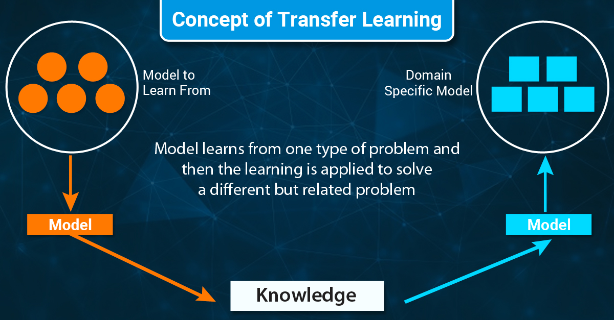
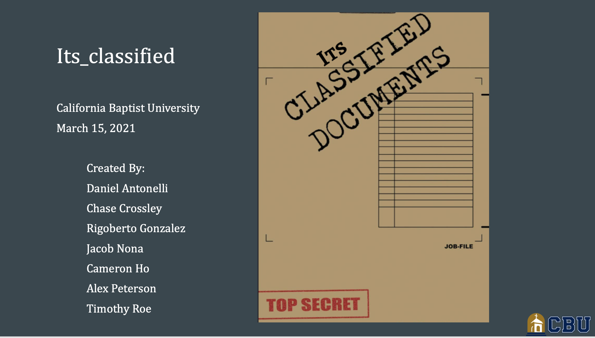
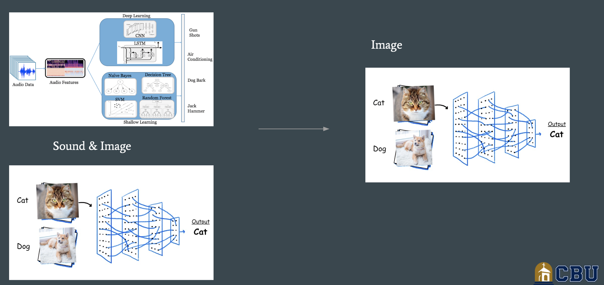

Return [Home](index.md)

# Blog 12: Midterm Project Presentation

This is the first week of Sprint 6. Although the previous week was the last week to complete all implementations, there
were some delay in finalizing the UI. The delay was caused due to the refactoring of the UI which ended up taking more
time than was anticipated. Because of this, our first week of sprint 6 was heavily concerned with making sure the UI
implementation will be completed. Our main objective for this first week was to have the team prepare the midterm
project presentation, work on completing the UI and re-edit deliverable 10 based on feedback from the client.
Additionally, some team members have started researching on possible strategies, and techniques that could help improve
the accuracy of the trained models.

[comment]: <> (TODO: Place the new burndown chart iimage in blog 12 folder, addtionally give a short summary of the 
status in our progress)
****
## Deliverable 10 Reflection

Based on the comments from deliverable 10, we re-edited the parts were a personal reflection was needed. This allowed
for team members to reflect back on the overall project, reconsider the challenges and setbacks that were encountered
during the merging of the two teams and the implementation of the project.Additionally, as a team we appreciated the
lessons learned with the process of creating this project, such as organization, communication, time-management and
responsibility of each individual task.

### Deliverable 10 Project Reflection

When building any project and when working with a group of individuals, who all bring their own style, creativity,
workflow, and passion to the table, it can be difficult combining these into one cohesive team. On top of these
differences, there is also the possibility of disagreements and conflict rising up. It is precisely for this reason why
groups projects have a bad reputation. And we all have had our fair share of a negative group project experiences,
however with this group, this has not been the case. Perhaps it’s because we have all known each other from previous
classes, we were able to get along extremely well. All member of the team will agree when I say that the overall team
collaboration, communication, and task management system went very smoothly. We have quite a big group and making sure
that each member is involved, active, and aware of the overall status of the project is no simple task. We believe this
is a major accomplishment that kept our team motivated and carried everyone forward. So, in terms of what went well,
this would be the major one.

## Model Efficiency Report

The model efficiency report consisted of different techniques and strategies that could aid the accuracy of the machine
learning model. In this report we investigate on how we could utilize these different techniques and strategies to our
trained models. Additionally, the report will give a brief overview of how the techniques are applied in different
training algorithms and how useful they benefit the model.

### Texture Transfer

One of the techniques found is texture transfer, and the use of texture transfer is one of the newer methods used
for image sampling and training datasets. It is also a pretty tricky process to add texture moving to an image. When an
image undergoes texture transformation, the synthesized image must preserve the original image object shape. Using
texture transfer is to synthesize a given image's texture and place that texture into the original image. A similar
approach to texture transfer is the method of image quilting, which consists of contouring, shading, lines, strokes, and
regions in an image. The process of quilting is similar to texture transfer except instead of synthesizing a textured
image with the original image, it would consist of stitching small patches of texture into the image.

### Transfer Learning

Another technique that we found is transfer learning and depending on the circumstance, sometimes it may not be ideal to
implement a machine learning model from scratch. Instead, you can utilize a model that has already been built and
trained. This process is known as transfer learning, and it's essentially the idea of reusing pre-trained models on a
new problem. The idea is to store the acquired skill and knowledge that the model obtained from the training and
applying that same information to a different but related problem. This approach is prevalent in deep learning models
because it allows you to train a new model with relatively little data. For example, a skill gained while training a
model to recognize vehicles can be applied to a new problem of identifying a specific car such as a truck, sedan, or
SUV. In these situations, all you need to do is load in the model and utilize the power of transfer learning.

## Midterm Presentation Packet

In addition to completing the UI the team also worked on preparing the presentation slides for the upcoming midterm. The
presentation will include a status update of our current progress, the initial problem statement, obstacles that were
encountered and what was done to overcome those obstacles. Additionally, it would include completed implementation
results thus far, and our future projections and where we're headed from here.

### Re-scoping the Project

In the presentation we will also share with the class on the current status of the project. As we have mentioned in the
past blog as a team we decided to switch routes from classifying image and sound to only focus on just image
classification. The reason we chose to focus on only image classification was because when generally when solving issues
in machine learning, it is best to focus on one specific problem. During the research phase,we discovered that tackling
two different problems is not an efficient strategy in machine learning implementation. The reason is that many
complications could emerge when image classification and sound classification are working under a single model.
Additionally, we decided as a team it was best to change the scope of the project to just image classification. This
allowed us to focus more on one type of classification and improve certain attributes of the project.

Updated by Daniel Antonelli & Rigoberto Gonzalez on 3/12/2021
