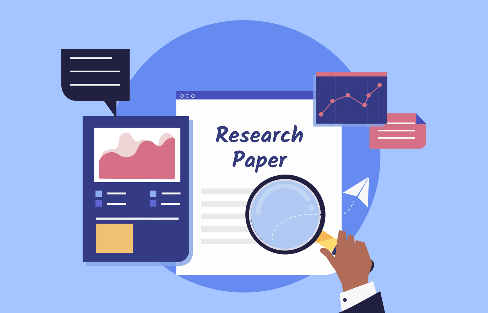

Return [Home](index.md)

# Blog 13: Midterm Project Presentation
This is the second week of Sprint 6. As a Team we are finishing up the final details of the new UI. While some team members
finish the construction of the UI, others have taken the initiative to start researching on the construction of an academic
research paper. Members have started to pick up tasks related to the creation of a research paper.

## Burndown Chart
This was the second week of Sprint 6. There is no burn down chart for our current progress because we have completed
implementation of the machine learning models, and finishing the last details of the User Interface.

## Research Paper
This week some members have taken the initiative to work on the creation of a research paper, some members have decided to
talk to professors in the engineering department on their expertise and knowledge on writing an academic paper. Additionally, 
looking for a place to publish an academic paper, is one of the teams important tasks to find. There are different types of
research publisher, those that are high-end ranking and low-end ranking. The high-end ranking publishers would expect the 
academic paper to be a high impact on the AI and ML community. While low-end publishers will publish papers that are low 
impact top the ML and AI community. 

Updated by Daniel Antonelli & Rigoberto Gonzalez on 3/20/2021
