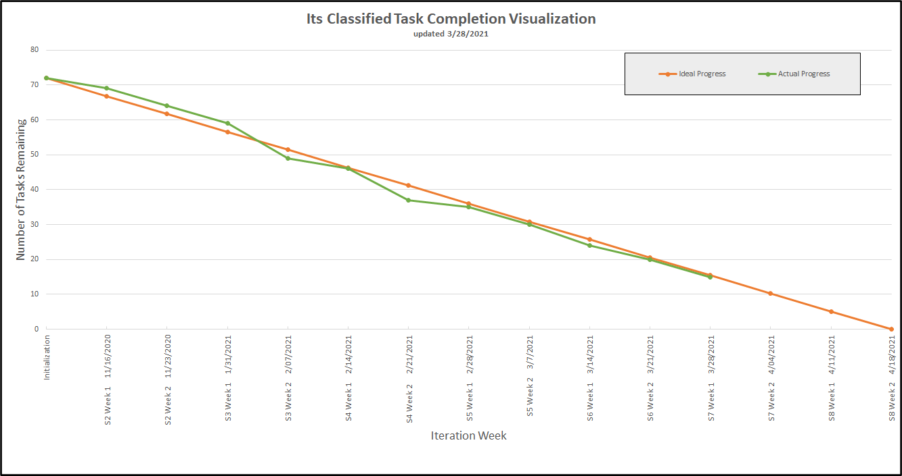
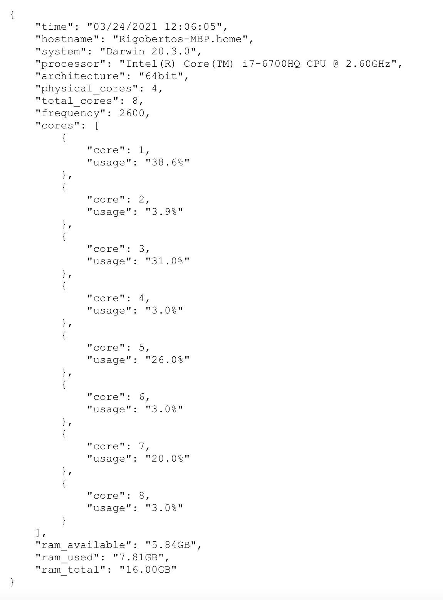

Return [Home](index.md)

# Blog 14: Research Paper and Testing

Sprint 7 weeks 1 consisted of researching and preparing an academic paper. Additionally, each member of the team ran the
generated model reports on their different OS hardware devices. After speaking with our client on Monday, we decided to
refactor our burn-down chart to reflect the remaining tasks of the project rather than just implementation. The revised
burn-down chart will discuss the revised burn-down chart in further detail below.

## Refactoring of Burndown Chart

As the title suggests, our previous burn-down chart only contained tasks related to the project's implementation, such
as machine learning model training and user interface. The revised burn-down chart now includes the overall tasks of the
project. The functions included in the current burn-down chart will contain work that reflects data analysis, research
paper, course deliverable, and presentation slides. As the burn-down chart illustrates, we have finished the
implementation phase of the project. We will be moving forward with the research and testing of the project. We are
currently ahead of our ideal progress and on track to completing our remaining tasks.

## Running the models

Initially, the model report was being generated only on two OS devices which were WindowsPC and macOS. The results from
the generated report obtained from these two devices were different when compared to each other. Therefore, to have a
comprehensive comparison and analysis of the OS devices, we decided to have each individual run the report on their
machine as a team. The objective of running the generated report was to address the speed of completing models on
specific OS devices. Doing this will allow us to discuss further how different OS devices and hardware specifications
can affect the model's performance. In the research paper, we will touch upon this issue and offer some possible
insights and solutions.

## Research Paper Formatting

In this task members were asked to review different research papers, take notes on the formatting structure, and report
findings with the team in a stand-up meeting. At one of the team meetings, we came to a consensus on the format of the
research paper, and how decided to move forward. The format that we decided as a team to write the research paper is as
follows:

#### Title:

Analyzing the effectiveness and efficiency of select machine learning classifiers

#### Abstract:

The main findings/results, and the significance of those findings/results. The central question or statement in which the
research will address. Brief context or background information of the research done, and specific topic of the research.

#### State of the Art:

The current situation regarding image classification and its applications with roadsigns and traffic. Additionally, the
US roadsigns convention discrepancy

#### Background Info/Anatomy of the Algorithms:

Information regarding how each of the models work mathematically and any background information regarding their
properties. Information on what exactly is being tested such as cross-validation, score report, classification report,
and prediction report.

#### Experiment

Procedure, in the IDE, the libraries used, API’s, and the devices that were used to perform the experiment, and the
technical specs. The datasets that were used and why we used them.

#### Results

Illustration of the results with plots, graphs and describe the times and data that was gathered from the code

#### Discussion

Discuss the results and their significance and clarify how the US roadsigns has discrepancy

#### Conclusion

Ending with a brief summarization of all the information that was discussed.

Updated by Daniel Antonelli & Rigoberto Gonzalez on 3/26/2021
