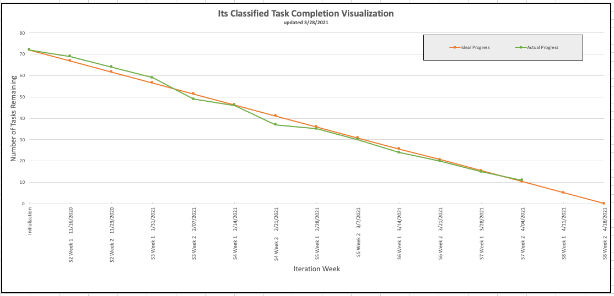

Return [Home](index.md)

# Blog 15: Research Paper and Testing

Sprint 7 weeks 2 consisted of researching and preparing an academic paper and starting testing. After speaking for
several engineering professors, we decided to restructure the format of our paper. As the burn-down chart illustrates,
we are continuing with the research and testing portion of the project. We are currently ahead of our ideal progress and
on track to completing our remaining tasks.

## Refactoring of Research Paper

Last week, the team members were asked to review different research papers, take notes on the formatting structure, and
report findings with the team in a stand-up meeting. At the meetings, we came to a consensus on the format of the
research paper and decided to move forward with the given structure. The format consisted of title, abstract, state of
the art, background Info/Anatomy of the Algorithms, experiment, results, discussion, and conclusion. However, after
speaking with our client and other engineering professors, we were informed that we did not necessarily have to complete
a whole draft of the paper. Instead, we only needed the abstract complete to submit it for potential publication.

Initially, the team was under the impression that completion of the whole draft was required, and this brought us
concerns about the required length of the paper and if we would be able to finish it on time. Our concerns were
addressed, and a suggestion that a thesis paper might be more suitable for our particular needs was given to us. As the
professor explained it to us, a research paper is often written by experts or professionals who answer a specific
question and provide a solution or further insight. On the other hand, a thesis is related to the statement of central
questions or Scholars' arguments leading to further research. In contrast, a research paper is about to prove that main
argument. It should mention and include all the main points that the research paper wants to address. Recent scientific
research highlights the computing demands of present Artificial Intelligence and Machine learning algorithms that progress
on autonomous vehicles is likely to slow down. The inception of this whole project sprung from this issue. In our
case, we began the project with the idea of analyzing the strengths and weaknesses of various machine learning
algorithms within the context of images encountered by autonomous vehicles. We were concerned with quantifying and
investigating the efficiency and accuracy of the different algorithms in classifying the given images. However, we
realized that image classification, among other issues, is not relevant; instead its object detection. So in
effect, we are not addressing a problem but simply examining the current limitations of these machine learning
algorithms. Therefore, we believe that a thesis paper rather full research paper is suitable for our needs.

Updated by Daniel Antonelli & Rigoberto Gonzalez on 4/3/2021
