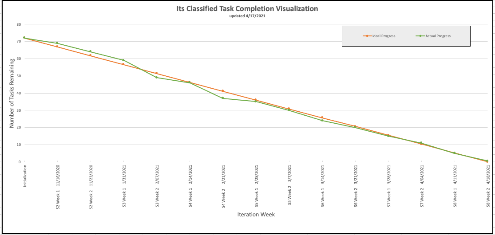
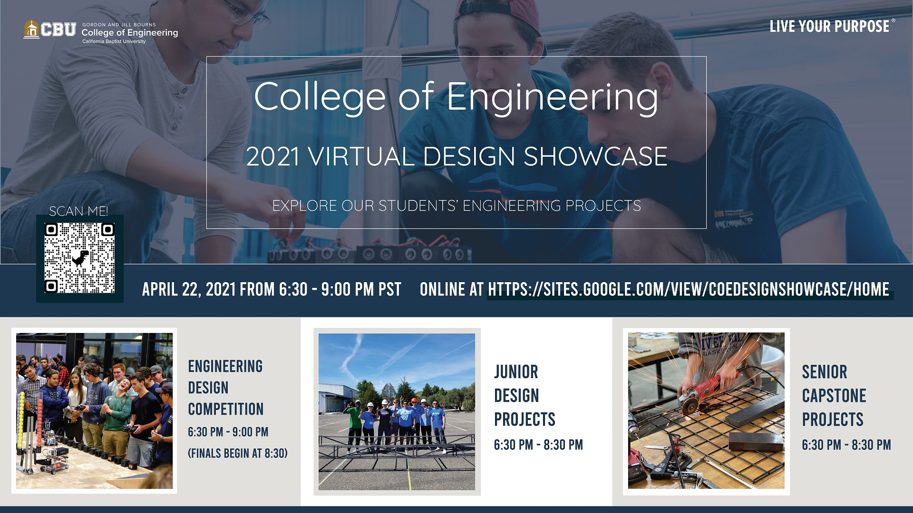

Return [Home](index.md)

# Blog 17: Research Paper and Testing

Sprint 8 weeks 2 consisted of writing an academic paper, preparing presentation slides for the design showcase, and
finishing testing. After speaking to several engineering professors, we have decided to choose a format and began
writing the research paper. In this week's burn-down chart, we worked on the writing of the research paper and finished
up the testing portion of the project. We are currently ahead of our ideal progress and on track to completing our
remaining tasks. The remaining tasks are the deployment of the application and final presentation slides.

## Reverting logsheet task's to weekly

As a team, we discussed the priority of finishing the project promptly and have everything prepared. That is why we, in
the remaining time we have transitioned from bi-weekly tasks to weekly tasks. The switch will help the team complete the
remaining tasks of deployment and final presentation.

## Preparing For Design Showcase

Besides working on the research paper, some team members prepared the two required presentation slides for the virtual
design showcase. The engineering school will have a virtual design showcase. The freshmen, junior, and senior class will
be presenting their projects to the public. In this event, each team will be giving a presentation of their projects.
The first presentation slides that we worked on consisted of sharing and informing the general public about the overall
project. And suppose people wanted to go into a private room with each team. In that case, the second slide gives them a
detailed explanation and demo of the completed project. In addition to these two tasks, each team member also worked on
the individual research paper.

Updated by Daniel Antonelli & Rigoberto Gonzalez on 4/17/2021
