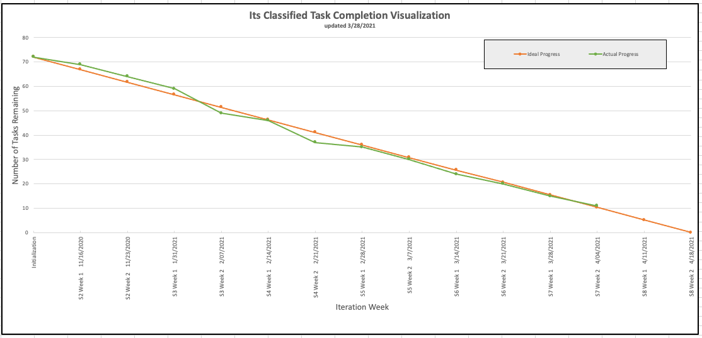
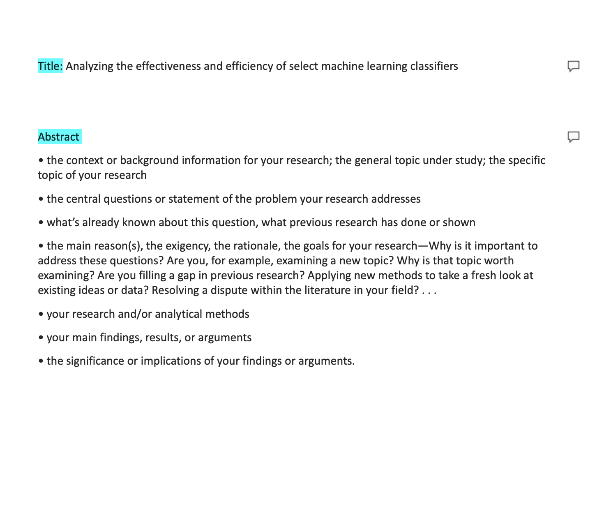

Return [Home](index.md)

# Blog 19: Research Paper and Testing

Sprint 8 weeks 1 consisted of researching and preparing an academic paper and starting testing. After speaking for
several engineering professors, we decided to restructure the format of our paper. As the burn-down chart illustrates,
we are continuing with the research and testing portion of the project. We are currently ahead of our ideal progress and
on track to completing our remaining tasks.

## Refactoring of Research Paper

After meeting with our client, the team has decided to reformat the structure of the thesis to now become a research
paper based off our findings. In this week's tasks, members were asked to review different research papers, take notes
on the formatting structure, and work on their assigned tasks in the paper. The members tasks were to fill out sections of
the research paper, such as title, abstract, state of the art, background Info/Anatomy of the
Algorithms, experiment, results, discussion, and conclusion.

Updated by Daniel Antonelli & Rigoberto Gonzalez on 4/17/2021
