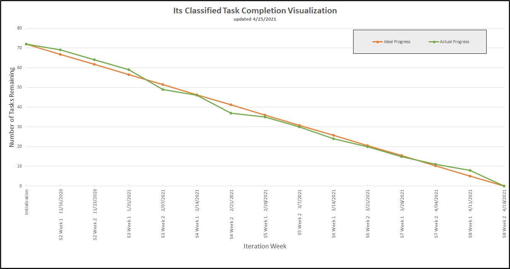
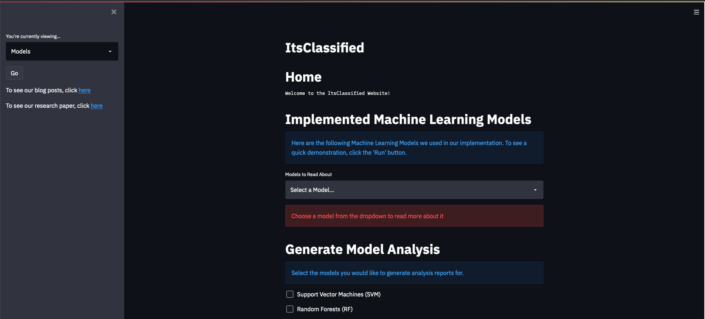
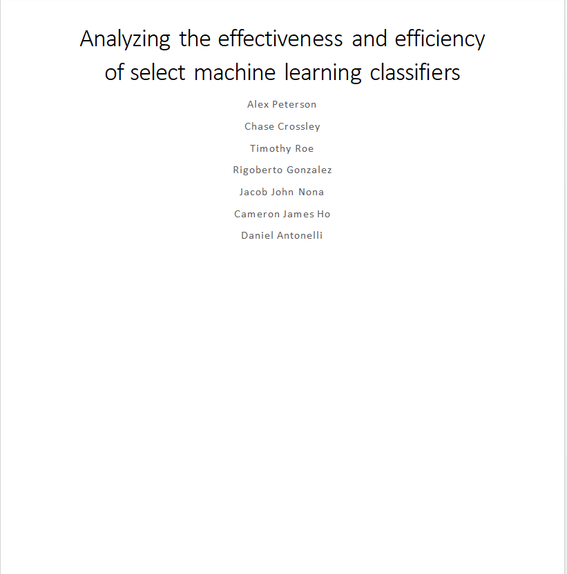

Return [Home](index.md)

# Blog 18: Design Showcase Presentation & Deployment of UI

This was the last semester of the week before finals hooray! Which means all of our tasks have been completed, as you
can view in our burndown chart. The team was mainly concerned with preparing for the virtual design showcase
presentation, which took place on Thursday. In addition, we also finished up the research paper and deployed our web
application. Which you can interact with [here](http://itsclassified-cbu.ml/)

## Completed Research Paper

The team was also able to complete the research paper. The research paper was the second deliverable of the project, and
we are happy to report that the team was able to complete the required deliverables successfully. As the title suggests,
the research paper seeks to quantify the strengths and weaknesses of various machine learning algorithms within the
context of self-driving cars. The report gives an in-depth analysis of the experiment that we performed and the results
that were obtained. For conveniences and accessibility, both the team's blog and research paper is linked to our web
application.

## Preparing For Final Presentation

The next class is the last class of the course, and the team's only remaining task is to prepare the final presentation
slides. During this time, the team will give a detailed presentation on our results as well as a demonstration of our
web applications.

Updated by Daniel Antonelli & Rigoberto Gonzalez on 4/24/2021
