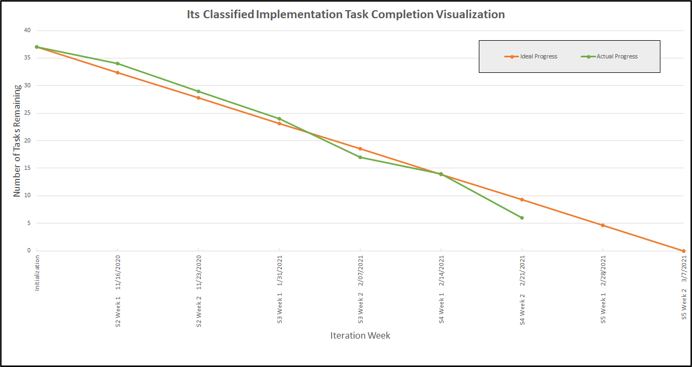

Return [Home](index.md)

# Blog 9: Refining AI Models & Completing Unit Tests

This week is the second week of Sprint Iteration 4. This week we are continuing to refine all of the AI Models and complete unit testing, adding more features to the UI, and more Research.

According to the burn down chart and the tasks that have been scheduled out, we are currently at 87% complete with the implementation of the project. With this we are working a little ahead of scheduled, which allows for the ability to correct mistakes that might be determined throughout the course of the development of the implementation as we enter the final weeks. The Gant chart is as follows:

## AI MODELS AND UNIT TESTING
Last week, we updated the dataset which required us to retrain all the models. To do this we updated the dataset database.
Doing this allows us to retrain the models without going into each of the AI models themselves and training them manually, we can train them all at once if wanted to.
To add onto the dataset updates, we reverted back to the training split. The reason why we are not using the 12,000 images to train and the 2,000 to test is because of the uneven weighting of the signs.
Using only the 2,000 images to train and test allows us to have a more even distribution of signs when training to have a more accurate models.
Having an even dataset means all of the classification categories, in our case stop signs and no right turn signs, will have the same amount of images to train and test from.
We also serialized the retrained models, to keep the "knowledge" that the AI had after training.
As far as unit testing goes, we are still in the process of completing these tests.

## UI IMPLEMENTATION
For the UI, we have added a few functions that gives the user more information when running the models on the UI.
We added a histogram of the dataset distribution for both training and testing.

We also added a bar that shows the progress of the image classification, and once it finishes it shows the sign type and accuracy of the model.

In addition to that we added a drop down menu and radio boxes that allows the user to choose different models, from the dropdown menu, and different graphical outputs, from the radio boxes.

## AUTOMATED RESULT UPLOADS TO CLOUD

The team also accomplished the goal of automatically uploading specified results to Google Drive in an organized fashion. This functionality was implemented as a shutdown hook. When the python interpreter begins to shutdown, some piece of code will run uploading the exact state of a specified folder to Google Drive. The organization strategy used is one folder per team member, along with the date and time the shutdown hook was executed.

## RESEARCH: CLASSIFICATIONS
In regards to classifications we found a lot of interesting topics and methods that help AI classify more accurately.
Specifically we found Ensemble Learning, Siamese Neural Network, Neural Network Layers, Transfer Learning, and Hyperparameter Tuning.
Ensemble learning is the ML technique of combining the predictions of multiple models at once; The idea behind this is that the combined knowledge of the models will give a more accurate prediction than just one model.
Siamese Neural Network allows for classification algorithms to be able to detect two images and ask each other in a voting system.
Neural Network layers are for more complex image datasets. Increasing the amount of layers that a neural network has utilizes the power of deep neural networks. Increasing the layers does not help with the accuracy, but it allows for more complex classifications.
As stated last week, there are a lot of types of image augmentation, and transfer learning utilizes that augmentation.
Using strategies like rotating, scaling, and flipping helps certain algorithms not have to learn things like edges.
Hyperparameter Tuning deals with the training parameters and making sure that the parameters that are in the model is the most optimal to ensure that the classification is as accurate as possible.

## RESEARCH: US STREET SIGN DISCREPANCIES
After more research on the topic of US street sign discrepancies, the exact amount of states that follow the UMTCD is 23, not including Colombia and Puerto Rico. These states and US sanctioned lands follow the MUTCD exactly without any alterations.
20 states adopted the manual and made a few changes, and 7 states have made lots of changes to the manual.

We also found that the there are 7 main types of sign categories. These categories are, Regulatory, Warning, Guide, Motorist Service, Construction, Recreation, and Cultural Interest. Along with these 7, there are 2 types of Non-Compliant to MUTDC and Superseded.
Regulatory signs are just the usual everyday signs like stop signs, warning signs like slippery road signs, guide signs like freeway exit signs, motorist service signs for motorcyclists, construction signs like "road work ahead" signs, and recreation and cultural interest signs that have to do with tourist locations.
Non-Compliant to MUTCD signs are signs that do not follow the MUTCD, and the Superseded signs are the signs that discontinued or retired.

Updated by Timothy Roe & Cameron Ho on 2/21/2021
